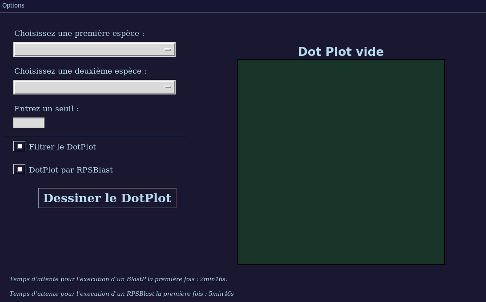

Si vous n'arrivez pas à bien visualiser le fichier, consulter l'adresse suivante : https://github.com/ThomasShanoky/ProjetDotPlot/blob/main/README.md
(Visualiser sur VSCode : Ctrl + K puis V)

# Programme DotPlot

### **Paramètres requis**

Avant de lancer le programme, vous devez vous assurer d'être dans un environnement linux possédant la commande `blastp` et ayant SQL (ou une autre variante) installé. Rentrez vos données pour rentrer dans SQL dans les premières lignes du fichier ConnectionToDataBase.py (dans les variables host, dbname, user et password). Vous devez également disposer d'un environnement où une interface graphique peut s'afficher (Si vous utilisez Windows, vous pouvez installer l'application *Xming* ; si vous utiliser un serveur pour lancer le programme, ne pas oublier l'option '-X' dans le ssh).

Pour executer le programme et lancer l'interface, veuillez d'abord accéder au dossier "ProjetDotPlot" (commande à entrer dans un terminal bash: `cd ProjetDotPlot`) puis executer le fichier *DotPlot_GUI* (commande : `python3 DotPlot_GUI.py`). 

### **Notice d'utilisation**

#### <u>Interface principale</u>

Ce programme a pour but d'afficher un dotplot entre deux génomes de procaryotes afin de détecter des potentiels réarrangements chromosomiques et/ou identifier des régions homologues. Le programme repose sur un blastp entre les deux protéomes des deux espèces qui identifie les gènes ayant une grande probabilité d'être homologues (=descendant d'une même séquence ancestrale). Un seuil peut être fixé (E-value) : plus ce seuil est petit, moins on verra de paires de gènes considérés comme homologues.

Avant d'afficher un DotPlot, le programme a besoin de 3 éléments indispensables : une première espèce (première liste déroulante), une deuxième espèce (deuxième liste déoulante) puis un seuil (à rentrer dans le format **1e- exposant** ). Les exposants conseillés sont 4 (pour un RPSBlast) ou 6 (pour un BlastP). En executant un blastp ou un rpsblast, il se peut que des erreurs de type "*CFastaReader: Hyphens are invalid and will be ignored around line*" apparaissent : ces erreurs n'empêchent pas d'avoir un résultat satisfaisant.

En dehors de ces arguments obligatoires à entrer pour afficher un DotPlot, il en existe d'autres, accessoires, situés en dessous de la ligne : 

* **"Filtrer le DotPlot"** : 
 même avec une-value seuil basse, il y a toujours beaucoup de bruit ; afin de réduire ce bruit et n'afficher que les points disposés en diagonale, vous pouvez cocher cette case pour ne voir que l'essentiel. 

* **"DotPlot par RPSBlast"** : 
 Au lieu d'utiliser un BlastP (détecter des homologues par similitude structurelle), cocher cette case utilisera la similitude fonctionnelle entre gènes pour le DotPlot. Un gène peut être associé avec des CDD (= Conserved Domain Database) avec chacun une e-value. On ne prend en compte que les CDD qui ont une e-value inférieure au seuil fixé. Pour chaque paire de gène, on calcule le nombre de CDD en commun divisé par le nombre de CDD de l'ensemble des deux gènes, qu'on assimile à la similarité fonctionnelle. Selon ce taux, le point apparaîtra d'une certaine couleur. 

#### <u>Menu Options</u> 

* Il n'y a qu'une quantité limité d'espèces dans la base de données au départ, vous pouvez en ajouter via l'option **"Ajouter une espèce"**. Pour ce faire, vous devez entrer le code <u>assembly</u> de l'espèce (trouvable dans le fichier *prokaryotes_complete-genomes_downloadable.csv*). Dès lors, un RPSBlast s'effectuera automatiquement sur cette nouvelle espèce.
* Si vous avez effectué un DotPlot que vous voulez enregistrer, vous avez l'option **"Sauvegarder le dernier DotPlot"**, puis entrez le nom que vous voulez donner à l'image.
